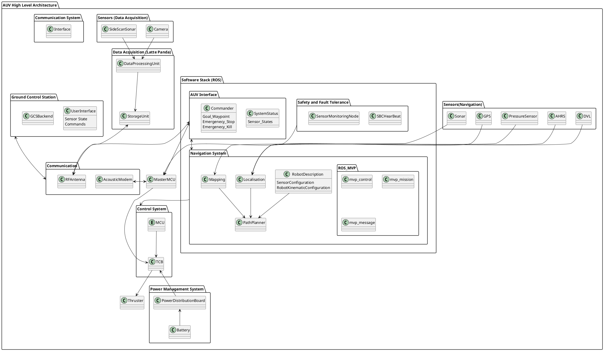

# AUV-Test

```plantuml
@startuml

package "AUV High Level Architecture" {
  package "Sensors(Navigation)" {
    class PressureSensor
    class Sonar
    class GPS
    class DVL
    class AHRS

  }
  
  package "Sensors (Data Acquisition)"
  {
      class Camera
    class SideScanSonar
  }

  package "Data Acquisition (Latte Panda)" {
    class DataProcessingUnit
    class StorageUnit
  }


  package "Communication System"
  {
  class Interface
  }

  package "Control System" {
    entity MCU
    class TCB
  }

  package "Communication" {
    class AcousticModem
    class RFAntenna
  }

  package "Power Management System" {
    class PowerDistributionBoard
    class Battery
  }

  package "Software Stack (ROS)" {
    package "Navigation System" {
    class Localisation
    class Mapping
    class PathPlanner
    class RobotDescription
    {
    SensorConfiguration
    RobotKinematicConfiguration
    }
    
        package ROS_MVP
    {
    class mvp_control
    class mvp_mission
    class mvp_message
    }
  }
  
    package "Safety and Fault Tolerance" {
    class SBCHearBeat
    class SensorMonitoringNode
  }
    package "AUV Interface"
    {
    class SystemStatus
    {
    Sensor_States
    }
    
    class Commander
    {
    Goal_Waypoint
    Emergenecy_Stop
    Emergenecy_Kill
    }
    }
    
  }

  class Thruster

  package "Ground Control Station"
  {
  class UserInterface
  {
  Sensor State
  Commands
  
  }
  
  class GCSBackend
  }
     Mapping --> PathPlanner
   Localisation --> PathPlanner
   RobotDescription --> PathPlanner
  GPS --> Localisation
  DVL --> Localisation
  AHRS --> Localisation
  PressureSensor --> Localisation
  Sonar --> Mapping
  Camera --> DataProcessingUnit
  SideScanSonar --> DataProcessingUnit
  DataProcessingUnit --> StorageUnit
  StorageUnit <--> RFAntenna
  "Navigation System" --> "Control System"
  MCU --> TCB
  TCB <-- PowerDistributionBoard
  "AUV Interface" <--> MasterMCU
  MasterMCU --> AcousticModem
   AcousticModem --> MasterMCU 
  "AUV Interface" <--> RFAntenna
  PowerDistributionBoard <-- Battery
   "Safety and Fault Tolerance" --> MasterMCU
  TCB --> Thruster
  "Ground Control Station" <--> "Communication"
   MasterMCU --> TCB
   "AUV Interface" <--> "Navigation System"

   
}

@enduml
```
